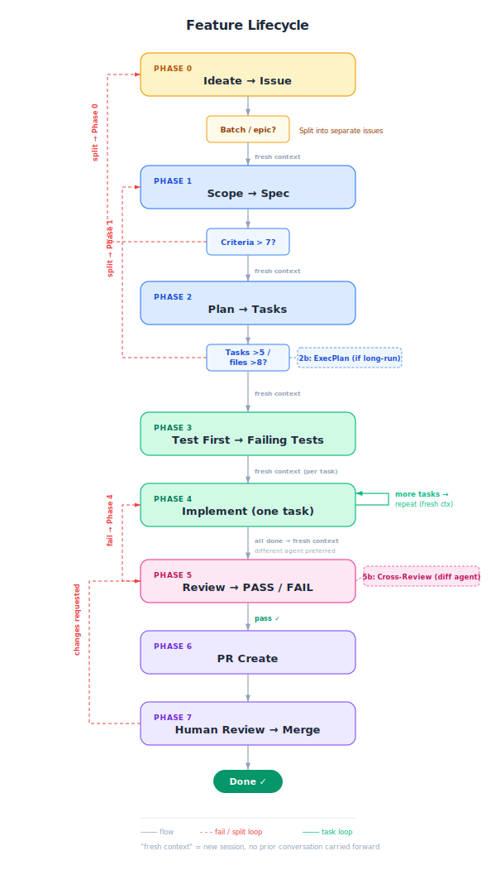

# Agent Workflow Scaffold

A reusable project scaffolding system for agent-assisted development workflows. It provides instruction files, templates, CI configuration, and structured lifecycle prompts that work across Claude Code, Codex, and GitHub Copilot.

## Setup

1. **Download** the latest `scaffold-template.zip` from the [Releases page](./releases/latest).
2. **Extract** the zip into any project root. All files land at their correct relative paths — no renaming or restructuring needed.
3. **Customize** the following files for your project:
   - **`AGENTS.md`** — Replace placeholder values: project name, build/test/lint commands, architecture overview, and naming conventions. This is the single source of truth that all agents read.
   - **`.claude/settings.json`** — Adjust tool permissions and hooks for your stack (e.g., formatter command, lint command).
   - **`.github/workflows/copilot-setup-steps.yml`** — Replace placeholder steps with your actual runtime setup, install, build, and test commands.
   - **`.codex/config.toml`** — Adjust sandbox and model settings if using Codex.
4. **`CLAUDE.local.md`** is gitignored and intended for personal preferences (verbosity, communication style). Do not put project rules there.

> **Note:** The meta-prompts used to drive the workflow are maintained separately in this repository under `/meta-prompts/`. They are not included in the template zip — reference them directly from this repo when running planning, build, or review sessions.

---

## Workflow Diagram



---

## Principles

### Engineering Principles

- Every feature starts as acceptance criteria — if you cannot write the criteria, and communicate what you want explicitly, you cannot build the feature.
- Tests are written before implementation and committed separately so they can be reviewed independently.
- Keep every PR reviewable in under 15 minutes; if the diff is too large to review quickly, the feature was scoped too large.
- Small diffs, atomic commits, and frequent pushes are safer than large diffs, squashed commits, and rare pushes.
- Deterministic automation (linters, formatters, type-checkers, CI) enforces rules that instruction files cannot reliably guarantee. Don't do in AGENTS what can reliably done with pre-existing tools.
- The human bottleneck is review, not generation — optimize the workflow for reviewer speed, not author speed.

## Instruction and Context Principles

- Instruction files should be short (under 60 lines at root level) and contain only what a language model needs to know.
- AGENTS.md is the single source of truth for cross-tool instructions; CLAUDE.md imports it rather than duplicating it.
- Do not repeat instructions across files — duplication causes drift, and drift causes inconsistent agent behavior.
- Write plans and decisions to files, not chat — conversation history degrades as context fills, but files persist across sessions.
- Document what the agent gets wrong, not everything it should do — reactive instruction updates are more effective than comprehensive manuals.
- Instruction files are reviewed like code; stale instructions are worse than no instructions.

## Tool-Specific Principles

- Claude Code is the primary tool for deep, multi-file work that requires codebase understanding, architectural reasoning, and interactive judgment.
- Codex is strongest for well-specified tasks that can run unattended, for multi-hour structured execution via PLANS.md, and for PR review as a 'third-party'.
- Copilot is strongest for in-editor completions, inline suggestions, GitHub-native PR workflows, and as the coding agent for issue-to-PR automation within the GitHub ecosystem. It can do a lot but has fewer tokens to play with, typically.
- When an agent gets stuck in a loop, switch to a different tool for a fresh perspective; Claude catches what Codex misses and vice versa.

## Context-Length and Token-Efficiency Principles

- Treat context like a budget — every file included, every instruction loaded, and every conversation turn costs tokens that reduce quality at the margin. Clear your conversation frequently.
- Start every new task in a fresh session; use /clear after completing each task, not just when context runs out.
- Use /compact proactively at 60% context usage, not reactively at 95% when quality has already degraded.
- Never carry planning context into implementation context — write the plan to a file, clear the session, and start implementation by reading the file.
- Include only the files a task actually touches as context, not the full repository; use @ references to pull in specific files rather than descriptions of what the project does.
- If you compact more than twice in one session, the task is too large or the prompt is too vague — stop, re-scope, and start fresh.

## Git and Rollback Principles

- Commit after every accepted change — this is the single most protective habit, comparable to saving in a game before a boss fight.
- Use git worktrees to run parallel agents on non-overlapping tasks; each worktree gets its own branch and its own agent session.
- Never let two agents edit overlapping files simultaneously — no current tool prevents conflicts across parallel sessions. School of hard knocks will teach you this quickly.
- Feature branches should be short-lived; if a branch lives longer than a day, the feature is too large.
- Post-merge CI runs are non-negotiable; if they fail, revert first and investigate second.
- Worktree cleanup is part of the workflow — delete worktrees and branches after merge to prevent disk bloat and confusion.

---

## Repository Structure

```
/template/                          — Distributable scaffolding (zipped in releases)
/meta-prompts/
  major/                            — 3 consolidated session meta-prompts (Plan, Build, Review & Ship)
  minor/                            — Per-phase meta-prompts (Phase 0–7)
/.github/workflows/
  release-template.yml              — Release workflow for zip distribution
/workflow-diagram.svg               — Workflow lifecycle diagram
/Principles for Development Using the Workflow.md
/LICENSE
/README.md                          — This file
```

---

## Meta-Prompt Reference

The workflow is driven by **meta-prompts** — structured instructions you paste into an agent session. Two levels are available:

### Major Meta-Prompts (consolidated sessions)

| # | File | Phases | Purpose |
|---|------|--------|---------|
| 1 | [`meta-prompts/major/01-plan.md`](meta-prompts/major/01-plan.md) | 0 → 2 | Interactive batch session for ideation, scoping, and task planning. |
| 2 | [`meta-prompts/major/02-build.md`](meta-prompts/major/02-build.md) | 3 → 4 | Autonomous session for test-first development, one feature at a time. |
| 3 | [`meta-prompts/major/03-review-and-ship.md`](meta-prompts/major/03-review-and-ship.md) | 5 → 7 | Batch review and PR creation for completed features. |

### Minor Meta-Prompts (per-phase)

Available in [`meta-prompts/minor/`](meta-prompts/minor/) for granular use when a full consolidated session is not needed. Covers each phase individually (Phase 0 through Phase 7), allowing you to run a single phase in isolation.
