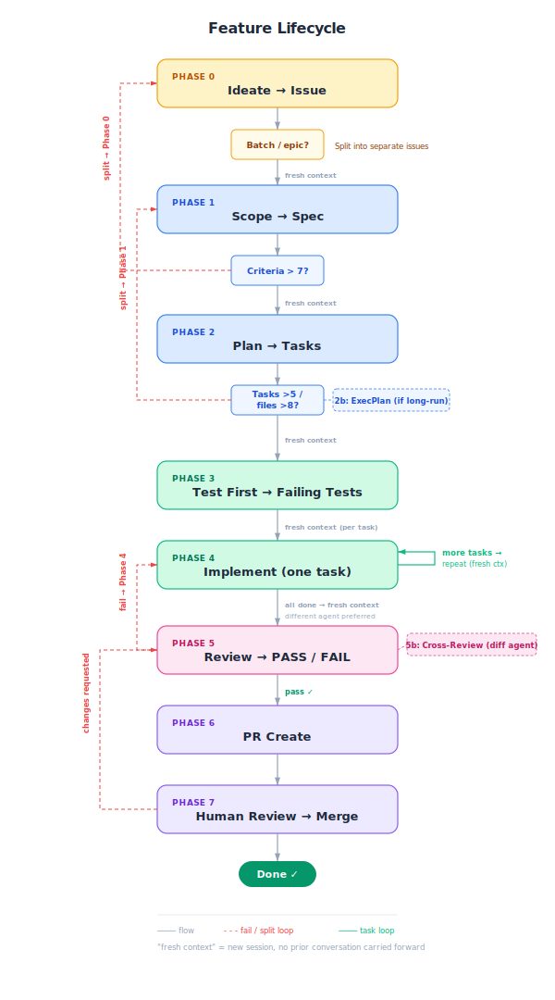

# Agent Workflow Scaffold

Drop-in scaffold for agent-driven development with Claude, Copilot, and Codex. Implements an **8-phase agentic workflow** where agents interview you to define the goal, then build it autonomously.

> **Start here:** Read this README, then [AGENTS.md](template/AGENTS.md), then browse the [example project](examples/sample-project/) to see what "done" looks like.



## Prerequisites

| Requirement | Required? | Notes |
|-------------|-----------|-------|
| **Git** | Yes | Any recent version |
| **Claude Code** or **GitHub Copilot Chat** | At least one | Claude Code for `/commands`, Copilot for `.prompt.md` files |
| **OpenAI Codex** | Optional | For batch/unattended execution |
| **VS Code** (or Cursor) | Recommended | For Copilot prompt integration |

You do **not** need all three AI platforms. Pick the one(s) you use:
- **Claude Code only:** Use `/commands` (e.g., `/compass`, `/implement`, `/continue`)
- **Copilot only:** Use `.prompt.md` files (copy to your VS Code prompts directory)
- **Both + Codex:** Full multi-agent routing with parallel worktrees

## Quick start

### Option A: Install script

```bash
# From the scaffold repo root:
./scripts/install.sh /path/to/your/project

# With Copilot prompts:
./scripts/install.sh --with-prompts /path/to/your/project
```

### Option B: Manual setup

1. Download a release ZIP (`scaffold-template.zip`, `scaffold-metaprompts.zip`, or `scaffold-full.zip`)
2. Extract `template/` contents into your project root
3. (Optional) Copy `prompts/*.prompt.md` to your [VS Code prompts directory](#command-installation-paths)

### Option C: GitHub template

Use the "Use this template" button on GitHub, then delete files you don't need.

### After setup

1. Open an AI coding session at your project root
2. Run the initialization meta-prompt (see [How to run a meta-prompt](#how-to-run-a-meta-prompt))
3. The Compass interview starts automatically — answer the questions
4. After Compass + Define Features + plan approval (Phases 2–5), run **`/continue`** to let the agent build autonomously
5. Come back, refresh context, run `/continue` again — the agent picks up where it left off

> `/continue` is the primary command. It detects your current phase, executes it, and auto-advances to the next. It pauses at stop gates (Compass interview, plan approval, blocking bugs) and tells you what input is needed.

For updates to an existing scaffold: Run [`meta-prompts/update.md`](meta-prompts/update.md).

## How to run a meta-prompt

Meta-prompts are instruction files that you feed to an AI agent. They are **not** scripts.

| Platform | How to run |
|----------|-----------|
| **Claude Code** | Open a session at your project root. Paste the meta-prompt contents into the chat, or reference the file with `@meta-prompts/initialization.md` |
| **Copilot Chat** | Use the corresponding `.prompt.md` file as a slash command (e.g., type `/initialization` in Copilot Chat) |
| **Codex** | Reference the file in your Codex plan or paste contents into the Codex prompt |

After initialization, you won't need meta-prompts again — use slash commands (`/compass`, `/implement`, `/continue`, etc.) instead.

## How it works

Everything traces back to the **project constitution**. The Compass interview produces a `constitution.md` that defines exactly what gets built. Every feature spec cites a constitution capability. Every task cites an acceptance criterion. Every PR cites a test. Agents can't invent features — if it isn't in the constitution, it isn't in scope.

### How artifacts connect

```
Constitution          defines WHAT the project is
    |
    v
Feature Specs         define HOW TO VERIFY each capability (acceptance criteria)
    |
    v
Task Files            define WHAT TO BUILD (ordered, model-assigned tasks)
    |
    v
PRs                   prove THAT IT WORKS (test evidence per criterion)
    |
    v
Decisions             record WHY non-obvious choices were made
```

Artifact contracts enforce this chain: a spec without a task file is invalid, a criterion without a test is invalid, a PR without verification evidence is invalid. See [FILE_CONTRACTS.md](template/workflow/FILE_CONTRACTS.md).

## The 8-phase workflow

```
1. SCAFFOLD IMPORT   -> Place files in project (initialization.md)
2. COMPASS           -> Adaptive interview -> constitution.md
3. DEFINE FEATURES   -> Map features to constitution capabilities
4. SCAFFOLD PROJECT  -> Reason about architecture (no code)
5. FINE-TUNE PLAN    -> Ordered specs with ACs, model assignments, branches
6. CODE              -> TDD implementation from spec
7. TEST              -> Verify against acceptance criteria, log bugs
   7b. REVIEW & SHIP -> Review, cross-review, PR, merge (per feature)
8. MAINTAIN          -> Documentation, compliance, release notes
   BUG TRACK         -> Parallel bug capture from any phase
```

**Phases 2-3** require developer interviews. **Phases 4-5** require architecture decisions and plan approval. **Phases 6-8** run autonomously once the plan is approved — use `/continue` to auto-advance through phases until a stop gate is reached.

### V1 vs V2 commands

**V2 commands** handle the full project lifecycle (Phases 1-8): `/compass`, `/define-features`, `/scaffold`, `/fine-tune`, `/implement`, `/test`, `/maintain`, `/continue`.

**V1 commands** handle feature-level delivery (Review -> PR -> Merge): `/ideate`, `/scope`, `/plan`, `/review`, `/cross-review`, `/pr-create`, `/merge`. These integrate into V2 at Phase 7b and are also available standalone for established projects that skip the Compass flow.

Use `/continue` and it will invoke the right commands at the right time — you don't need to memorize the phase sequence.

## Platform support

| Feature | Claude Code | Copilot | Codex |
|---------|-------------|---------|-------|
| Compass interview (Phase 2) | `/compass` | `compass.prompt.md` | Manual |
| Feature definition (Phase 3) | `/define-features` | `define-features.prompt.md` | Manual |
| Architecture planning (Phase 4) | `/scaffold` | `scaffold.prompt.md` | Manual |
| Plan fine-tuning (Phase 5) | `/fine-tune` | `fine-tune.prompt.md` | Manual |
| TDD implementation (Phase 6) | `/implement` | `implement.prompt.md` | Via ExecPlan |
| Test verification (Phase 7) | `/test` | `test.prompt.md` | Via ExecPlan |
| Review & PR (Phase 7b) | `/review`, `/pr-create` | `review.prompt.md` | — |
| Maintenance (Phase 8) | `/maintain` | `maintain.prompt.md` | — |
| Auto-advance orchestration | `/continue` | `continue.prompt.md` | — |
| Bug tracking | `/bug`, `/bugfix` | `bug.prompt.md` | — |
| CI auto-fix on failure | — | — | `autofix.yml` |

## How routing works

`AGENTS.md` is the universal entrypoint read by every agent. It defines:
- Which phase you're in and what to do next
- Which model handles which task (Claude for reasoning, Copilot for UI, Codex for batch)
- Branch naming: `model/type-short-description`
- Boundaries: what's allowed, what needs approval, what's forbidden

Adapters (`CLAUDE.md`, `.github/copilot-instructions.md`, `.codex/AGENTS.md`) point back to `AGENTS.md` and translate commands for each platform. Adapters never redefine policy — `AGENTS.md` is always authoritative.

## What this gives you

- `AGENTS.md` as the canonical routing file
- `.specify/` templates: constitution, spec, and acceptance criteria
- Workflow + governance docs for execution and policy
- Templates for specs, tasks, and decisions
- Tool adapters for Claude, Copilot, and Codex
- Claude hooks (format, protect, test reminder)
- Review rubric and extended PR template
- CI workflows (setup validation, autofix — requires `ANTHROPIC_API_KEY` repository secret for autofix)

## After all phases complete

When all features have been built and documented, your project will contain:

- `.specify/constitution.md` — project identity, goals, boundaries (the permanent scope anchor)
- `/specs/[feature-id]-[slug].md` — one spec per feature with acceptance criteria
- `/tasks/[feature-id]-[slug].md` — one task file per feature with completion evidence
- `/decisions/[NNNN]-[slug].md` — architecture decisions made during the build
- `/bugs/LOG.md` — full bug history with fix status
- `AGENTS.md` — fully customized routing hub with your commands and conventions
- `README.md` — generated from the constitution and feature list (by Phase 8)
- `CONTRIBUTING.md` — contributor guide (generated in Phase 8)
- Merged PRs on `main` — one per feature, each with AC evidence

## ZIP choices

| ZIP | Includes |
| --- | --- |
| `scaffold-template.zip` | Template scaffold (`AGENTS.md`, `.claude/`, `.github/`, `.codex/`, and templates) |
| `scaffold-metaprompts.zip` | Copilot `.prompt.md` command files |
| `scaffold-full.zip` | Template scaffold + Copilot prompt files |

## Scaffold layout

```text
/template/
  AGENTS.md                          # Universal routing hub (read first by all agents)
  CLAUDE.md                          # Claude adapter -> AGENTS.md
  /.specify/
    constitution.md                  # Project identity (from Compass)
    spec-template.md                 # Feature spec template
    acceptance-criteria-template.md  # EARS + GWT criteria format
  /workflow/
    LIFECYCLE.md                     # Lifecycle index (project + feature phases)
    PLAYBOOK.md                      # Phase execution contract + gates
    FILE_CONTRACTS.md                # Artifact ownership + validation rules
    FAILURE_ROUTING.md               # Retry/escalation paths
  /governance/
    CHANGE_PROTOCOL.md               # Safe instruction-change process
    POLICY_TESTS.md                  # Policy checks mapped to validation
    REGISTRY.md                      # Canonical policy file registry
  /specs/_TEMPLATE.md                # Feature spec template
  /tasks/_TEMPLATE.md                # Task plan + evidence template
  /decisions/_TEMPLATE.md            # Decision record template
  /.github/
    copilot-instructions.md          # Copilot adapter -> AGENTS.md
    REVIEW_RUBRIC.md                 # 6-category review scoring
    pull_request_template.md         # Extended PR template with AC evidence
    /agents/
      planner.agent.md              # Planning specialist agent
      reviewer.agent.md             # Review specialist agent
    /workflows/
      copilot-setup-steps.yml       # CI with spec validation
      autofix.yml                   # Auto-fix on CI failure
  /.claude/
    settings.json                    # Hooks: format, protect, test reminder
    /commands/                       # 12 v2 commands (compass through continue)
  /.codex/
    AGENTS.md                        # Codex adapter -> AGENTS.md
    config.toml                      # Codex runtime config
  /scripts/
    setup-worktree.sh               # Worktree creation for parallel agents
```

## Command installation paths

- Linux: `~/.config/Code/User/prompts/`
- macOS: `~/Library/Application Support/Code/User/prompts/`
- Windows: `%APPDATA%/Code/User/prompts/`
- WSL2 + Windows VS Code: `/mnt/c/Users/[WindowsUser]/AppData/Roaming/Code/User/prompts/`
- VS Code Insiders: use `Code - Insiders` in the path
- Cursor: use `Cursor` in the path

## Troubleshooting

See [TROUBLESHOOTING.md](TROUBLESHOOTING.md) for common issues:
- Agent ignoring workflow rules
- Wrong phase detected by `/continue`
- Constitution needs changing mid-build
- Session context pollution
- CI failures and autofix

## Maintainers

### Prompt file architecture

Each workflow phase has up to 3 parallel files that must stay in sync:

| Layer | Location | Purpose | Format |
|-------|----------|---------|--------|
| **Meta-prompt** (canonical) | `meta-prompts/minor/*.md` | Source of truth for phase logic | Markdown with fenced operational block |
| **Claude command** (derived) | `template/.claude/commands/*.md` | Claude Code slash command | Plain operational content |
| **Copilot prompt** (derived) | `prompts/*.prompt.md` | VS Code Copilot slash command | YAML frontmatter + operational content |

Meta-prompts are canonical. Claude commands and Copilot prompts are derived. Use `scripts/sync-prompts.sh` to regenerate derived files, or run [`meta-prompts/prompt-sync.md`](meta-prompts/prompt-sync.md) in an AI session.

### Major vs minor meta-prompts

- **`meta-prompts/minor/`** — One file per workflow phase. These are the canonical source for each phase's logic.
- **`meta-prompts/major/`** — Session-oriented batch prompts that combine multiple phases into sustained deep-work sessions (plan-session, build-session, review-session). These are convenience wrappers, not canonical sources.
