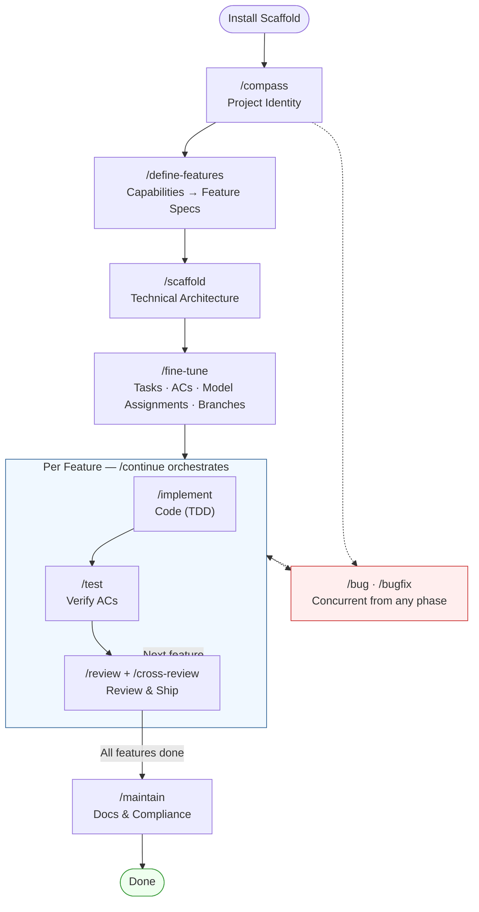

# Workflow Diagram

```mermaid
flowchart TD
    START([Install Scaffold]) --> P2

    P2["/compass<br/>Project Identity"]
    P2 --> P3["/define-features<br/>Capabilities → Feature Specs"]
    P3 --> P4["/scaffold<br/>Technical Architecture"]
    P4 --> P5["/fine-tune<br/>Tasks · ACs · Model Assignments · Branches"]

    P5 --> LOOP

    subgraph LOOP ["Per Feature — /continue orchestrates"]
        P6["/implement<br/>Code (TDD)"]
        P7["/test<br/>Verify ACs"]
        P7R["/review + /cross-review<br/>Review & Ship"]
        P6 --> P7 --> P7R
    end

    P7R -->|Next feature| LOOP
    P7R -->|All features done| P8["/maintain<br/>Docs & Compliance"]
    P8 --> DONE([Done])

    BUG["/bug · /bugfix<br/>Concurrent from any phase"]
    P2 -.-> BUG
    LOOP -.-> BUG
    BUG -.-> LOOP

    style BUG fill:#fee,stroke:#c33
    style LOOP fill:#f0f8ff,stroke:#369
    style DONE fill:#efe,stroke:#393
```
