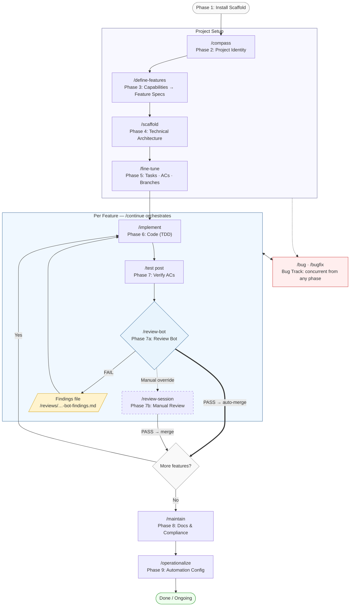

# Workflow Diagram

```mermaid
flowchart TD
    START([Phase 1: Install Scaffold]) --> P2

    subgraph SETUP ["Project Setup"]
        P2["/compass<br/>Phase 2: Project Identity"]
        P3["/define-features<br/>Phase 3: Capabilities → Feature Specs"]
        P4["/scaffold<br/>Phase 4: Technical Architecture"]
        P5["/fine-tune<br/>Phase 5: Tasks · ACs · Branches"]
        P2 --> P3 --> P4 --> P5
    end

    P5 --> P6

    subgraph LOOP ["Per Feature — /continue orchestrates"]
        P6["/implement<br/>Phase 6: Code (TDD)"]
        P7["/test post<br/>Phase 7: Verify ACs"]
        P7A{"/review-bot<br/>Phase 7a: Review Bot"}
        P7B["/review-session<br/>Phase 7b: Manual Review"]

        P6 --> P7 --> P7A
        P7A -->|FAIL| FINDINGS[/"Findings file<br/>/reviews/…-bot-findings.md"/]
        FINDINGS --> P6
        P7A -.->|"Manual override"| P7B
    end

    P7A ==>|"PASS → auto-merge"| MORE{More features?}
    P7B -->|PASS → merge| MORE
    MORE -->|Yes| P6
    MORE -->|No| P8

    P8["/maintain<br/>Phase 8: Docs & Compliance"]
    P9["/operationalize<br/>Phase 9: Automation Config"]
    P8 --> P9 --> DONE([Done / Ongoing])

    BUG["/bug · /bugfix<br/>Bug Track: concurrent from any phase"]
    SETUP -.-> BUG
    LOOP -.-> BUG
    BUG -.-> LOOP

    style START fill:#f9f9f9,stroke:#999
    style SETUP fill:#f8f8ff,stroke:#669
    style LOOP fill:#f0f8ff,stroke:#369
    style BUG fill:#fee,stroke:#c33
    style FINDINGS fill:#fff3cd,stroke:#d4a017
    style P7A fill:#e8f4fd,stroke:#369
    style P7B stroke-dasharray: 5 5
    style MORE fill:#f9f9f9,stroke:#999
    style DONE fill:#efe,stroke:#393
```
