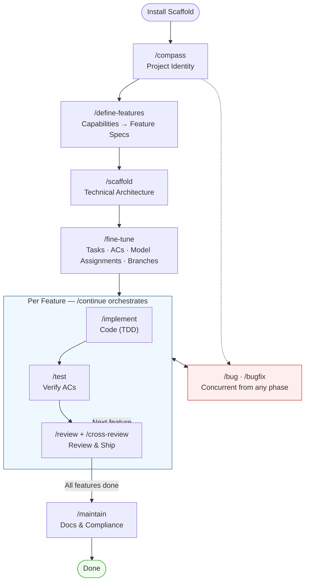

# Phase 5: New Workflow Diagram + Final Verification

> **Status**: COMPLETE
> **Prereqs**: Phase 4 complete
> **Outcome**: New Mermaid workflow diagram. All verification passes. AGENTS.md routing correct.

## Objective

Replace the deleted `workflow-diagram.svg` with an accurate Mermaid diagram. Run comprehensive verification across the entire repo.

---

## Step 1: Create New Workflow Diagram

### 1a. Create Mermaid diagram

The diagram must accurately reflect the current workflow:
- 8 project-level phases
- Concurrent bug track
- Phase gates
- No version language

Suggested Mermaid (embed inline in README.md or `docs/reference/workflow-diagram.md`):



### 1b. Decide placement

**Option A (recommended)**: Embed directly in README.md in the ## Workflow section (renders on GitHub).

**Option B**: Create `docs/reference/workflow-diagram.md` and link from README.

Choose based on README line count — if embedding keeps README ≤ 100 lines, embed. Otherwise, link.

### 1c. Optional: Generate SVG export

If an SVG is desired alongside Mermaid:
```bash
# Using mermaid-cli (if available)
npx -p @mermaid-js/mermaid-cli mmdc -i docs/reference/workflow-diagram.md -o docs/reference/workflow-diagram.svg
```

This is optional — Mermaid renders natively on GitHub.

---

## Step 2: Update AGENTS.md Routing Table

Read `template/AGENTS.md` and verify:

### 2a. All listed commands exist
Every command referenced in AGENTS.md must have corresponding files in:
- `meta-prompts/*.md`
- `prompts/*.prompt.md`
- `template/.claude/commands/*.md`

### 2b. No deleted commands remain
Verify none of these appear: ideate, scope, plan (standalone), execplan, review (standalone), pr-create, merge, fix-prompt, full-build, plan-session.

### 2c. New commands are listed
Verify these are in the routing table:
- `/build-session` → `06b-build-session.md`
- `/review-session` → `07d-review-and-ship.md`
- `/cross-review` → `07e-cross-review.md` (marked optional)

### 2d. Phase numbering is correct
Ensure the phase table in AGENTS.md matches the actual numbered files in meta-prompts/.

---

## Step 3: Comprehensive Final Verification

### 3a. Test suite
```bash
scripts/test-scripts.sh
```

### 3b. Prompt parity
```bash
scripts/sync-prompts.sh --check
```

### 3c. Scaffold validation
```bash
scripts/validate-scaffold.sh
```

### 3d. Zero version language
```bash
grep -ri --include="*.md" --include="*.sh" --include="*.json" \
  "v1\|v2\|legacy\|version 1\|version 2" \
  prompts/ meta-prompts/ template/ scripts/ README.md TROUBLESHOOTING.md \
  docs/reference/ docs/quickstart-first-success.md docs/README.md \
  | grep -v "docs/simplification/" \
  | grep -v "/proc/version" \
  | grep -v "schemaVersion"
```
Must return zero hits.

### 3e. Zero stale references
```bash
# No references to deleted files/dirs
for term in "archive/" "workflow-diagram.svg" "SPECS.md" "examples/" "sample-project" \
            "meta-prompts/minor" "meta-prompts/major" "00-full-build" "01-plan.md" \
            "ideate" "execplan" "fix-prompt" "pr-create"; do
  HITS=$(grep -ri "$term" README.md docs/ meta-prompts/ template/ scripts/ prompts/ \
    TROUBLESHOOTING.md --include="*.md" --include="*.sh" 2>/dev/null \
    | grep -v "docs/simplification/" | wc -l)
  [ "$HITS" -gt 0 ] && echo "STALE: $term ($HITS hits)" || true
done
```

### 3f. Install end-to-end
```bash
TMPDIR=$(mktemp -d)
scripts/install.sh "$TMPDIR"
echo "Files installed: $(find "$TMPDIR" -type f | wc -l)"

# Verify critical files
for f in AGENTS.md CLAUDE.md workflow/STATE.json workflow/LIFECYCLE.md workflow/PLAYBOOK.md; do
  [ -f "$TMPDIR/$f" ] && echo "OK: $f" || echo "MISSING: $f"
done

# Verify no legacy files
for f in ideate scope plan execplan review pr-create merge fix-prompt; do
  find "$TMPDIR" -name "*${f}*" 2>/dev/null | grep . && echo "LEAK: $f in install" || true
done

rm -rf "$TMPDIR"
```

### 3g. Cross-reference integrity
```bash
# All workflow/ files referenced in AGENTS.md exist
grep -oP 'workflow/\S+\.md' template/AGENTS.md | while read -r f; do
  [ -f "template/$f" ] && echo "OK: $f" || echo "BROKEN LINK: $f"
done
```

---

## Verification Commands (complete list)

```bash
echo "=== Test Suite ==="
scripts/test-scripts.sh && echo "PASS" || echo "FAIL"

echo "=== Sync Check ==="
scripts/sync-prompts.sh --check && echo "PASS" || echo "FAIL"

echo "=== Version Language ==="
HITS=$(grep -ri "v1\|v2\|legacy" prompts/ meta-prompts/ template/ scripts/ README.md \
  --include="*.md" --include="*.sh" \
  | grep -v "docs/simplification/" | grep -v "/proc/version" | grep -v "schemaVersion" | wc -l)
echo "Version language hits: $HITS"
[ "$HITS" -eq 0 ] && echo "PASS" || echo "FAIL"

echo "=== Diagram Exists ==="
grep -q "mermaid\|flowchart\|workflow-diagram" README.md && echo "PASS: diagram in README" || echo "CHECK docs/"

echo "=== AGENTS.md Routing ==="
# Spot check a few commands
for cmd in compass define-features scaffold fine-tune implement test continue bug bugfix maintain; do
  grep -qi "$cmd" template/AGENTS.md && echo "OK: $cmd in AGENTS.md" || echo "MISSING: $cmd"
done
```

---

## Acceptance Criteria

- [ ] New Mermaid workflow diagram committed (in README or docs/)
- [ ] Diagram shows: 8 phases, concurrent bug track, per-feature loop, no version language
- [ ] AGENTS.md routing table matches actual available commands (no stale, no missing)
- [ ] All test scripts pass
- [ ] `sync-prompts.sh --check` passes
- [ ] Zero version-language hits outside `docs/simplification/`
- [ ] Zero stale references to deleted files/directories
- [ ] Install end-to-end produces correct output
- [ ] Cross-reference integrity verified (all AGENTS.md links resolve)

## Files Summary

- **Created**: Workflow diagram (Mermaid in README or docs/reference/)
- **Modified**: README.md (embed diagram), AGENTS.md (routing table update if needed)
